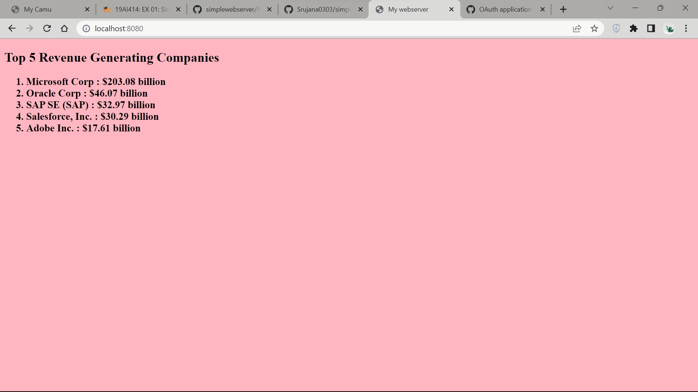

# EX01 Developing a Simple Webserver
## Date:12/10/2023

## AIM:
To develop a simple webserver to serve html pages.

## DESIGN STEPS:
### Step 1: 
HTML content creation.

### Step 2:
Design of webserver workflow.

### Step 3:
Implementation using Python code.

### Step 4:
Serving the HTML pages.

### Step 5:
Testing the webserver.

## PROGRAM:
```
<!DOCTYPE html>
<html>
    <head>
      <title>My webserver</title>
   </head>
   <body bgcolor="#FFB6C1">
      <h2>
      Top 5 Revenue Generating Companies
      <h2>
      <h3>
         <ol type="1" font-size>
            <LI> Microsoft Corp : $203.08 billion</LI>
            <LI> Oracle Corp : $46.07 billion</LI>
            <LI> SAP SE (SAP) : $32.97 billion</LI>
            <LI> Salesforce, Inc. : $30.29 billion </LI>
            <LI> Adobe Inc. : $17.61 billion </LI>
         </ol>
      </h3>
   </body>
</html>
```

## OUTPUT:





## RESULT:
The program for implementing simple webserver is executed successfully.
